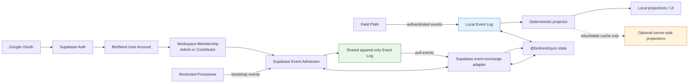
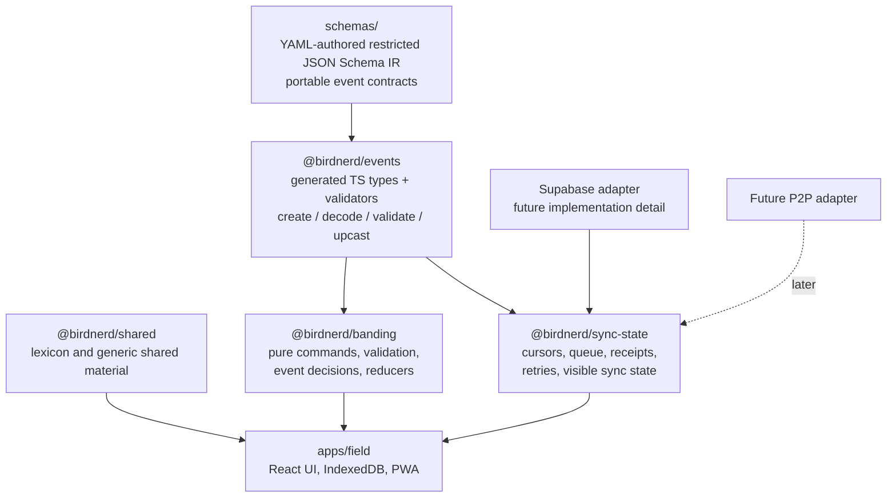
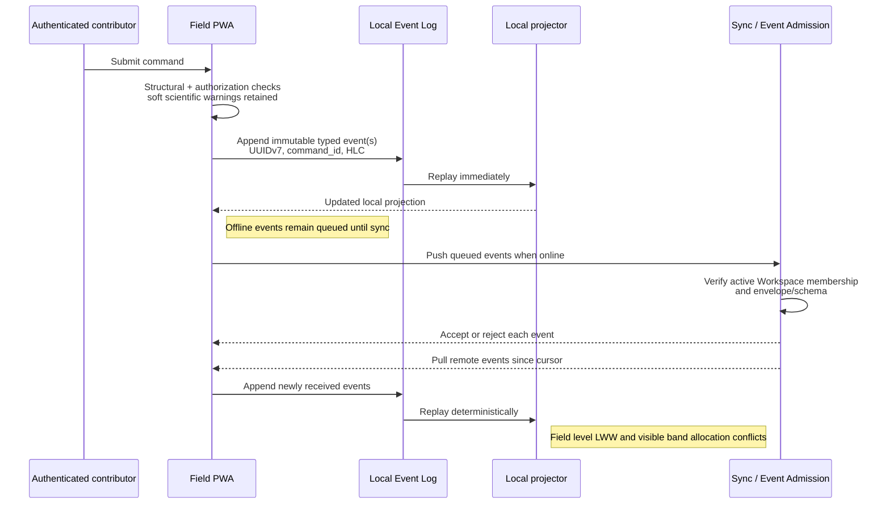

# Phase 26 — Assumptive Architecture Diagrams

These diagrams capture only the architecture decisions confirmed during the
Phase 26 design review. They intentionally omit unresolved implementation
details, including hybrid-logical-clock encoding, restricted-provisioner
authority mechanics, event-catalog tooling, explicit history merge/adoption,
and P2P event signatures.

## Runtime and Trust Model

## Package and Contract Structure

## Event and Projection Behavior

