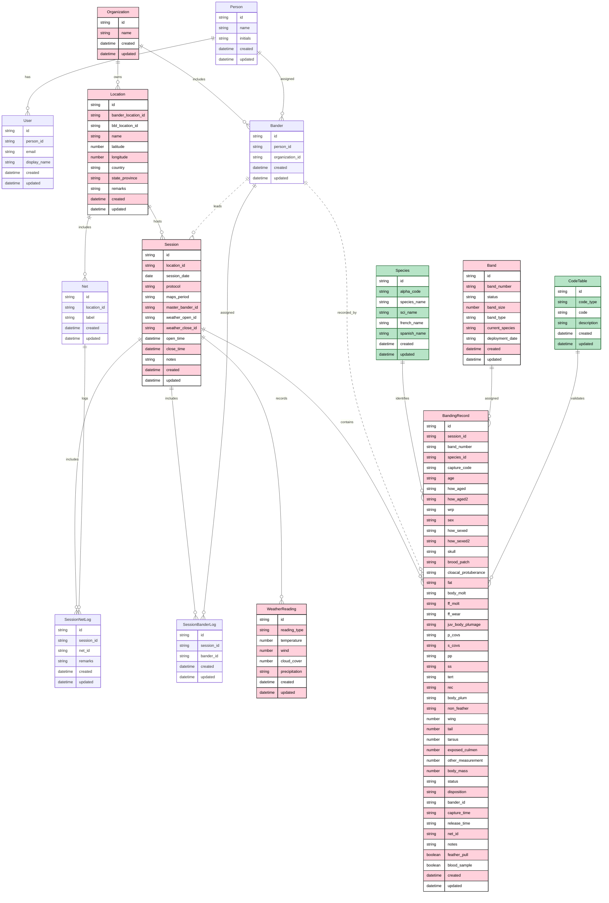

# BirdNerd Entities

```mermaid
erDiagram
    Organization {
        string id
        string name
        datetime created
        datetime updated
    }

    Person {
        string id
        string name
        string initials
        datetime created
        datetime updated
    }

    User {
        string id
        string person_id
        string email
        string display_name
        datetime created
        datetime updated
    }

    Bander {
        string id
        string person_id
        string organization_id
        datetime created
        datetime updated
    }

    Location {
        string id
        string bander_location_id
        string bbl_location_id
        string name
        number latitude
        number longitude
        string country
        string state_province
        string remarks
        datetime created
        datetime updated
    }

    Session {
        string id
        string location_id
        date session_date
        string protocol
        string maps_period
        string master_bander_id
        string weather_open_id
        string weather_close_id
        datetime open_time
        datetime close_time
        string notes
        datetime created
        datetime updated
    }

    Net {
        string id
        string location_id
        string label
        datetime created
        datetime updated
    }

    SessionNetLog {
        string id
        string session_id
        string net_id
        string remarks
        datetime created
        datetime updated
    }

    SessionBanderLog {
        string id
        string session_id
        string bander_id
        datetime created
        datetime updated
    }

    WeatherReading {
        string id
        string reading_type
        number temperature
        number wind
        number cloud_cover
        string precipitation
        datetime created
        datetime updated
    }

    Species {
        string id
        string alpha_code
        string species_name
        string sci_name
        string french_name
        string spanish_name
        datetime created
        datetime updated
    }

    BandingRecord {
        string id
        string session_id
        string band_number
        string species_id
        string capture_code
        string age
        string how_aged
        string how_aged2
        string wrp
        string sex
        string how_sexed
        string how_sexed2
        string skull
        string brood_patch
        string cloacal_protuberance
        string fat
        string body_molt
        string ff_molt
        string ff_wear
        string juv_body_plumage
        string p_covs
        string s_covs
        string pp
        string ss
        string tert
        string rec
        string body_plum
        string non_feather
        number wing
        number tail
        number tarsus
        number exposed_culmen
        number other_measurement
        number body_mass
        string status
        string disposition
        string bander_id
        string capture_time
        string release_time
        string net_id
        string notes
        boolean feather_pull
        boolean blood_sample
        datetime created
        datetime updated
    }

    Band {
        string id
        string band_number
        string status
        number band_size
        string band_type
        string current_species
        string deployment_date
        datetime created
        datetime updated
    }

    CodeTable {
        string id
        string code_type
        string code
        string description
        datetime created
        datetime updated
    }

    Organization ||--o{ Location : owns
    Organization ||--o{ Bander : includes
    Person ||--o{ Bander : assigned
    Person ||--o{ User : has

    Location ||--o{ Net : includes
    Location ||--o{ Session : hosts
    Session ||--o{ SessionNetLog : includes
    Session ||--o{ SessionBanderLog : includes
    Session ||--o{ WeatherReading : records
    Session ||--o{ BandingRecord : contains

    Net ||--o{ SessionNetLog : logs

    Bander ||--o{ SessionBanderLog : assigned

    Bander ||..o{ Session : leads
    Bander ||..o{ BandingRecord : recorded_by

    Species ||--o{ BandingRecord : identifies
    Band ||--o{ BandingRecord : assigned

    CodeTable ||--o{ BandingRecord : validates

    classDef entitySpec fill:#ffd1dc,stroke:#333,stroke-width:1px,color:#000
    classDef referenceData fill:#b7e4c7,stroke:#2f6f3e,stroke-width:1px,color:#000
    class Organization,Location,Session,WeatherReading,Band,BandingRecord entitySpec
    class Species,CodeTable referenceData
```
