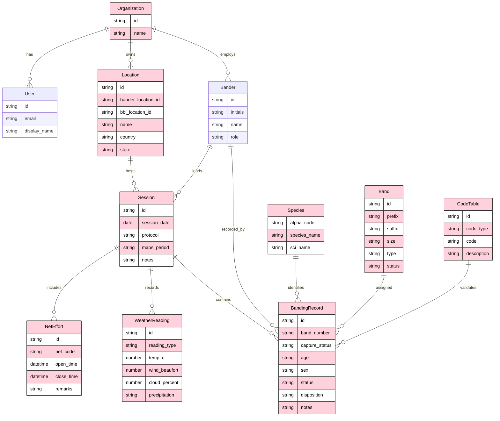

# BirdNerd Entities

```mermaid
erDiagram
    Organization {
        string id
        string name
    }

    User {
        string id
        string email
        string display_name
    }

    Bander {
        string id
        string initials
        string name
        string role
    }

    Location {
        string id
        string bander_location_id
        string bbl_location_id
        string name
        string country
        string state
    }

    Session {
        string id
        date session_date
        string protocol
        string maps_period
        string notes
    }

    NetEffort {
        string id
        string net_code
        datetime open_time
        datetime close_time
        string remarks
    }

    WeatherReading {
        string id
        string reading_type
        number temp_c
        number wind_beaufort
        number cloud_percent
        string precipitation
    }

    Species {
        string alpha_code
        string species_name
        string sci_name
    }

    BandingRecord {
        string id
        string band_number
        string capture_status
        string age
        string sex
        string status
        string disposition
        string notes
    }

    Band {
        string id
        string prefix
        string suffix
        string size
        string type
        string status
    }

    CodeTable {
        string id
        string code_type
        string code
        string description
    }

    Organization ||--o{ User : has
    Organization ||--o{ Location : owns
    Organization ||--o{ Bander : employs

    Location ||--o{ Session : hosts
    Session ||--o{ NetEffort : includes
    Session ||--o{ WeatherReading : records
    Session ||--o{ BandingRecord : contains

    Bander ||--o{ Session : leads
    Bander ||--o{ BandingRecord : recorded_by

    Species ||--o{ BandingRecord : identifies
    Band ||--o{ BandingRecord : assigned

    CodeTable ||--o{ BandingRecord : validates

    classDef entitySpec fill:#ffd1dc,stroke:#333,stroke-width:1px,color:#000
    class Organization,Location,Session,NetEffort,WeatherReading,Band,BandingRecord,Species,CodeTable entitySpec
```
