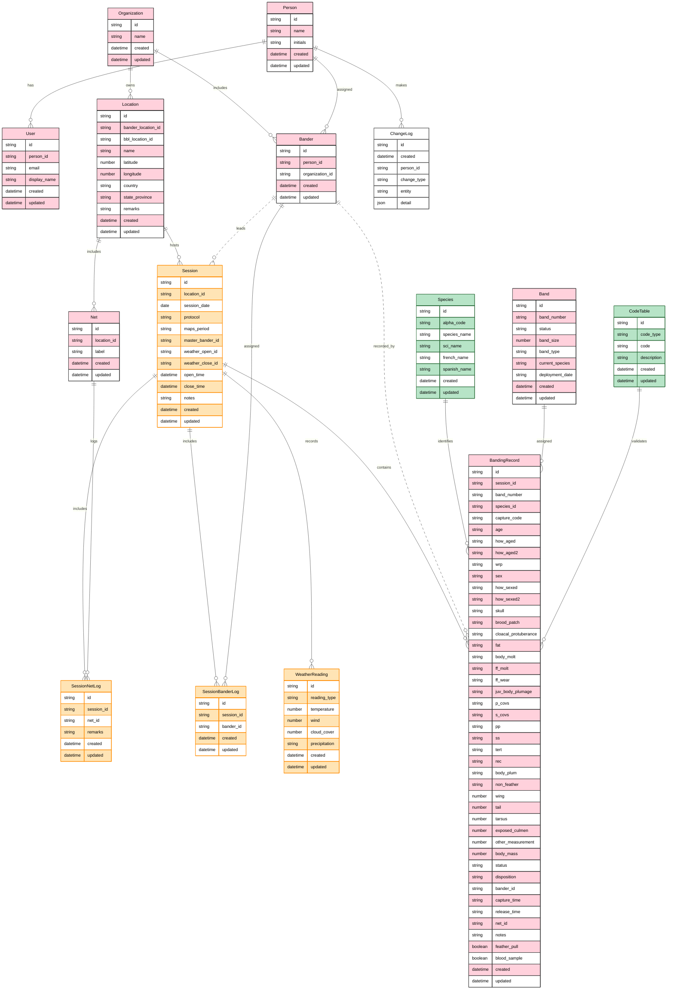
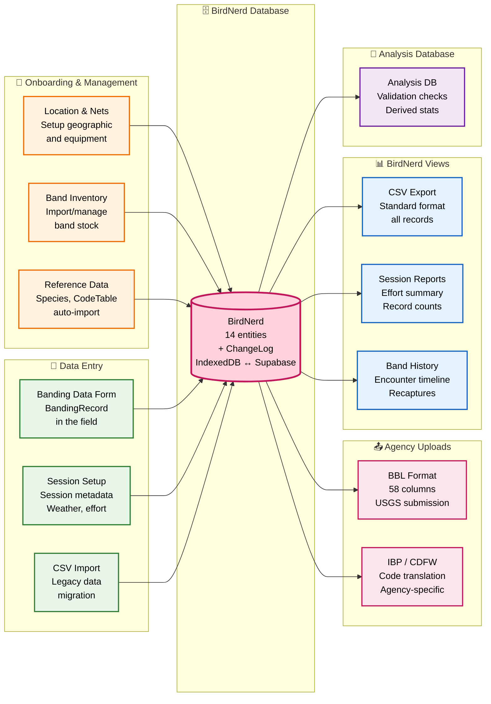

# BirdNerd Entities

## Color Coding Conventions

The ER diagram uses colors to categorize entity types:

- **Pink** — General BirdNerd operational entities (core business objects)
  - Organization, Person, User, Bander, Location, Net, Band, BandingRecord
- **Orange** — Session-related data (tracking one banding session and its participants/efforts)
  - Session, SessionNetLog, SessionBanderLog, WeatherReading
  - *Note: May be split into separate schema in future phases for multi-tenant data isolation*
- **Green** — Reference data from canonical external sources (imported, read-mostly)
  - Species (from USGS BBL master list)
  - CodeTable (from USGS BBL LOOKUPS sheet)
- **White** — Immutable audit/change log data (append-only, no updates or deletes)
  - ChangeLog (complete record of all entity changes)

---

## Data Flow Diagram

