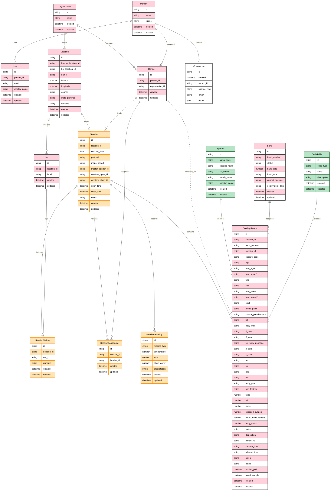

# BirdNerd — Product Specification

**See also:** [tech-specifications.md](tech-specifications.md) (architecture, database schema, implementation details) | [entities.md](entities.md) (ER diagram) | [plan.v3.md](plan.v3.md) (development roadmap)

---

## 1. Product Vision

BirdNerd is a progressive web app for bird banders to collect, manage, and export banding data in the field and back in the office. It serves as a **band deployment manager** — data is anchored around USGS BBL-issued band numbers, with sessions providing contextual metadata for each encounter.

**Primary users:** Bird banders at field stations following MAPS/IBP protocols.
**Primary devices:** iPhone, iPad. Android supported.
**Key constraint:** Must work offline in the field with no connectivity. Sync when online.

---

## 2. Core Modules

**Home Screen** — Navigation hub with access to all features.

**Session Module** — Create and manage banding sessions (location, date, protocol, weather, effort tracking).

**Banding Data Collection** — Primary form for recording individual bird encounters (90% of field time).

**Location Manager** — CRUD for project locations and associated nets.

**Band Inventory** — Add, track, and manage band stock.

**Export / Reports** — Export data in multiple formats (CSV, BBL, IBP), generate session summaries, view band history.

---

## 3. Screens & User Experience

For comprehensive screen layouts, wireframes, and interaction patterns, see [docs/ux-specifications.md](ux-specifications.md).

---

## 4. Data Model Summary

The app uses **14 core entities** organized by function: operational (field station data), session (banding session data), reference (static lookups), and immutable (audit log). For complete field-level schema definitions, see [tech-specifications.md § 2 Data Model](tech-specifications.md#2-data-model).

### 3.1 Entity Relationship Diagram

### 3.2 Entity Overview

**Operational (Pink):** Organization (top-level tenant), Person (human base), User (login), Bander (person + organization + role), Location (field station), Net (physical net), Band (USGS band), BandingRecord (encounter/capture event).

**Session (Orange):** Session (daily banding session), SessionNetLog (per-net effort tracking), SessionBanderLog (bander participation), WeatherReading (conditions at session open/close).

**Reference (Green):** Species (1,323 species from USGS BBL), CodeTable (120+ code lookups — age, sex, molt, status, how-aged, how-sexed, capture methods, etc.).

**Immutable (White):** ChangeLog (append-only audit trail of all entity changes).

For detailed field definitions, constraints, and data types, see [tech-specifications.md § 2 Data Model](tech-specifications.md#2-data-model).

### 3.3 Key Product Concepts

**Band Inventory & Status:** Each band from BBL has a lifecycle: `available` → `deployed` (assigned to bird) → recaptured, replaced, destroyed, lost, or retired. The app tracks current status and deployment date.

**Bander Registry:** Banders are linked to an organization with a role (Master Bander, Sub-permittee, Bander, Trainee) and active status. This enables selective participation in sessions and role-based validation rules.

**Session Structure:** A session (date + location + protocol) contains multiple nets and involves multiple banders. Each net's effort is logged separately (times, remarks), and bander participation is tracked. This supports flexible crew composition and differential effort calculation.

**Validation Datasets (Future):** We will provide species-specific ranges for morphometrics (wing, tail, tarsus, etc.) and code consistency rules to flag unusual combinations (e.g., HY adult molt codes, season/sex mismatches).

### 3.4 Database Conventions

1. **Primary Key:** All entities use `id` (string) as primary key.
2. **Audit Timestamps:** Operational and reference entities have `created` (insertion time) and `updated` (modification time). This supports change tracking and conflict resolution for offline sync.
3. **Immutable Tables:** ChangeLog has only `id` and `created` (no `updated`). New records document changes; records are never deleted or modified.
4. **Future Tables:** Any additions must follow the same convention.

---

## 5. Validation Rules

### 5.1 Priority Validations (red in doc — implement early)

| Rule | Trigger | Behavior |
|------|---------|----------|
| Code × Band history | Recaptured band selected as New, Destroyed, or Band Lost | Error: block or show only valid options |
| New band × Inventory | New band must pair with unused/available band number | Error |
| Species × Band size | Band size doesn't match standard for species | Warning with override: "Did you gauge the leg?" → auto-note "Leg gauged" |
| Sex=M + BP 3-4 | Male with Heavy/Wrinkled brood patch | Error |
| Sex=F + CP 1-3 | Female with any cloacal protuberance | Error |
| SK in How Aged + no Skull | Skull used for aging but skull field empty | Require skull entry |
| Age=U → How Aged | How Aged not needed | Make How Aged optional |
| Sex=U → How Sexed | How Sexed not needed | Make How Sexed optional |
| How Aged/Sexed = OT | "Other" selected | Require note before save |
| Status 500 | Sick/Injured/Stressed | Require disposition + note |
| Status "---" or Other | Mortality or Other | Require note |
| Blood Sample + Status | Blood sample checked | Validate Status = 318 |
| Morphometrics × Species | Wing/Tail/Tarsus/Culmen/Mass outside known range | Warning (soft) |

### 5.2 Future Validations (blue in doc)
- Status × Disposition cross-validation
- Self-validation across contradicting data in multiple categories
- Season × species × age/sex/molt consistency

### 5.3 Validation Philosophy
- **Soft warnings by default** — birds escape, partial records are valuable
- **Hard blocks only** for logical impossibilities (Sex=M + BP=Heavy)
- **Override mechanism** — user can acknowledge and proceed (with auto-note)
- **Required fields** marked with * are enforced at submission time, not during entry

---

## 6. Dual Code Systems (IBP vs BBL)

The master spreadsheet reveals a critical complexity: many fields have **IBP** and **BBL** variants with different code systems. The spreadsheet uses formulas to convert between them.

Examples:
- How Aged IBP uses single letters (C, S, P, etc.) → How Aged BBL uses 2-letter codes (CL, SK, PL)
- Body Molt IBP is numeric (0-4) → Body Molt BBL is Y/N
- FF Molt IBP is letter (N, A, S, J) → FF Molt BBL is Y/N
- Code IBP (N, D, R, F, etc.) → Code BBL is numeric (1, 4, etc.)

**Recommendation:** Store data in the richer IBP format internally. Derive BBL format via mappings at export time. The LOOKUPS sheet + spreadsheet formulas document all mappings.

---

## 7. Bander Registry

The app needs a bander registry (even before auth):
- Bander initials (2-letter, used in data: HD, TS, etc.)
- Full name
- Role: Master Bander, Sub-permittee, Bander, Trainee
- Active/inactive

Current known banders:
- HD — Hallie Daly (Master Bander)
- JW — Julie Woodruff (Sub-permittee)
- TS — Tatyana Soto-Bartzi (Sub-permittee)
- JVD — Joanna van Dyk (Sub-permittee)
- LC — Lucas Corneliussen (Sub-permittee)

---

## 8. Open Decisions & TODOs

This is the **canonical list** of unresolved design decisions and outstanding TODOs. All other docs should point here rather than maintaining their own lists.

### 8.1 Data Model

- [ ] Add `role` and `active` fields to Bander entity in ER diagram (already in tech-spec, not yet in entities.md mermaid)
- [ ] Reconsider whether `master_bander_id` should remain a FK on Session, or if all session leaders should be pulled from SessionBanderLog
- [ ] Band number format: Numeric (115481501) or formatted (1154-81501)?
- [ ] Bander ID format on records: 2-letter initials, full name, or both?
- [ ] BBL upload-only fields: decide which become first-class BandingRecord fields vs derived/export-only
- [ ] Capture details: add `how_captured`, `scribe`, `banded_leg`, `eye_color`, `weight_time`?
- [ ] Bill measurements: add `bill_length`, `bill_width`, `bill_height` (BBL upload has these in addition to culmen)?
- [ ] Recapture fields: add `how_obtained`, `present_condition`, `second_band_number`, `reward_band_number`, `replaced_band_number`?
- [ ] Nest/effort fields: add `net_nest_cavity_designator`, `net_nest_cavity_number`, `plot_id`, `sweep_number`, `nest_location`?
- [ ] Sampling/tests fields: add `genetic_sample`, `other_tests`, `tracheal_swab`, `mouth_swab`, `cloacal_swab`, `ectoparasites_present`, `ectoparasites_collected`?
- [ ] User-defined fields: support BBL `User Field 1-5`, or map to notes/extra metadata?

### 8.2 UX & Workflow

- [ ] Status code UX: Present as composite (300, 318, 500) or let users build from base + additional info?
- [ ] Required fields timing: When to start enforcing * required fields? Phase 3? Phase 4?
- [ ] Session ↔ Banding linkage: How tight? Auto-populate session fields on banding form? Validate net against session's opened nets?
- [ ] Empidonax / Selasphorus special forms: What do these look like? When to implement?
- [ ] Lindsay Wildlife / rehabbed birds: Location is where banded but record should reflect release location. Separate field? Note?

### 8.3 Infrastructure

- [ ] **Schema migration strategy:** Design a versioned migration system for IndexedDB that (a) handles incremental schema changes (new stores, new fields, backfills) as we add entities through Phases 3-9, and (b) ensures local schema maps cleanly to Postgres when Supabase arrives in Phase 10. idb supports version-based upgrades natively — formalize this into a migration runner with numbered migrations. Target: Phase 8 (after Location/Net entities exist in Phase 7, before Session expansion in Phase 9 adds WeatherReading, SessionNetLog, SessionBanderLog, Bander). Each IndexedDB migration should have a corresponding Postgres migration written alongside it for future use.

### 8.4 Code Systems

- [ ] IBP vs BBL storage: Store IBP internally, derive BBL at export? (Recommended)
- [ ] Blood Sample validation: Doc says "validate Status is 518" — likely means 318 (healthy + banded + blood sample). Confirm with Hallie.

### 8.4 Resolved

- [x] Galindo Creek location code: **GCBS** (Galindo Creek Banding Station) confirmed as the 4-letter code
- [x] Personnel → Bander ID mapping: Bander registry with initials + full name + role (implemented in data model)
- [x] Net/Trap linking: Nets defined at location level, referenced in SessionNetLog per session, banding records reference net via FK
