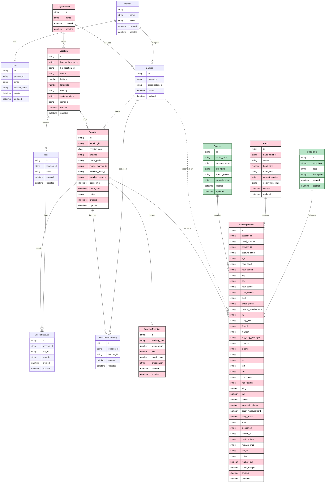

# BirdNerd — Product Specification (Draft v1)

## 1. Product Vision

BirdNerd is a progressive web app for bird banders to collect, manage, and export banding data in the field and back in the office. It serves as a **band deployment manager** — data is anchored around USGS BBL-issued band numbers, with sessions providing contextual metadata for each encounter.

**Primary users:** Bird banders at field stations following MAPS/IBP protocols.
**Primary devices:** iPhone, iPad. Android supported.
**Key constraint:** Must work offline in the field with no connectivity. Sync when online.

---

## 2. Architecture Overview

```
+--------------------+     +--------------------+     +--------------------+
|   Home Screen      |     |   Session Module   |     |   Banding Data     |
|   (navigation hub) |---->|   (session CRUD,   |---->|   Collection       |
|                    |     |    effort, weather) |     |   (main form)      |
+--------------------+     +--------------------+     +--------------------+
        |                                                      |
        v                                                      v
+--------------------+     +--------------------+     +--------------------+
|   Location Manager |     |   Band Inventory   |     |   Export / Reports |
|   (project sites)  |     |   (band lifecycle)  |     |   (CSV, BBL, IBP)  |
+--------------------+     +--------------------+     +--------------------+
```

### Technology
- Frontend: React 19 + TypeScript + Vite (client-side rendering only, no SSR ever)
- PWA: vite-plugin-pwa (offline, installable, home screen icon)
- Forms: React Hook Form
- Local storage: IndexedDB (via `idb`)
- Cloud storage (future): Supabase (Postgres + Auth)
- API (future): Generated from schema (OpenAPI or GraphQL TBD)
- Hosting: GitHub Pages (static)

---

## 3. Data Model

The data model is organized by entity type:
- **Specification Entities** (pink) — Core operational data for this field station
- **Reference Data** (green) — Lookup tables and validation data
- **Supporting** (other colors) — Administrative and tracking entities

### ER Diagram



### 3.1 Specification Entities (Field Station Data)

#### Organization
Top-level tenant. Each organization manages their own locations, banders, and records.

| Field | Type | Notes |
|-------|------|-------|
| id | string | Internal ID |
| name | string | Organization name (e.g., "Salton Sea Science Consortium") |
| created | datetime | Timestamp of record creation |
| updated | datetime | Timestamp of last update |

#### Location (Project Location / Banding Site)
A banding site registered with BBL, owned by an organization.

| Field | Type | Notes |
|-------|------|-------|
| id | string | Internal ID |
| banderLocationId | string(4) | 4-letter ALPHA code (e.g., GCFS) — local identifier |
| bblLocationId | string(6) | Issued by BBL after submission; nullable |
| name | string | Display name (e.g., "Galindo Creek Field Station") |
| latitude | number | Decimal degrees |
| longitude | number | Decimal degrees |
| country | string | |
| stateProvince | string | |
| remarks | string | |
| organizationId | string | FK to Organization |
| created | datetime | Timestamp of record creation |
| updated | datetime | Timestamp of last update |

#### Session
Metadata for a single banding session (day × location × protocol).

| Field | Type | Notes |
|-------|------|-------|
| id | string | Auto-generated session ID |
| locationId | string | FK to Location |
| sessionDate | date | ISO date (YYYY-MM-DD) |
| protocol | string | MAPS, Non-MAPS, Burrowing Owl, Rehabbed-Bird, Saw-whet Owl, etc. |
| mapsPeriod | number? | MAPS period number if applicable (1–10) |
| masterBanderId | string | FK to Bander (session lead) |
| weatherOpenId | string | FK to WeatherReading (at session open) |
| weatherCloseId | string | FK to WeatherReading (at session close) |
| openTime | datetime | When nets opened |
| closeTime | datetime | When nets closed |
| notes | string | Session-level notes |
| created | datetime | Timestamp of record creation |
| updated | datetime | Timestamp of last update |

#### Net
A single mist net or trap at a location.

| Field | Type | Notes |
|-------|------|-------|
| id | string | Internal ID |
| locationId | string | FK to Location |
| label | string | Net identifier (e.g., "N-01", "Trap-A") |
| created | datetime | Timestamp of record creation |
| updated | datetime | Timestamp of last update |

#### SessionNetLog
Per-net effort tracking within a session. Links nets to sessions and records open/close times and remarks.

| Field | Type | Notes |
|-------|------|-------|
| id | string | Internal ID |
| sessionId | string | FK to Session |
| netId | string | FK to Net |
| remarks | string? | Remarks code or text (wind, predators, low temps, etc.) |
| openTime | datetime? | When this net opened (may differ from session open) |
| closeTime | datetime? | When this net closed (may differ from session close) |
| created | datetime | Timestamp of record creation |
| updated | datetime | Timestamp of last update |

#### WeatherReading
Weather conditions at a point in time (session open or session close).

| Field | Type | Notes |
|-------|------|-------|
| id | string | Internal ID |
| readingType | enum | "session_open" or "session_close" |
| temperature | number | Celsius |
| wind | number | Beaufort scale or mph |
| cloudCover | number | Percentage (0–100) |
| precipitation | enum? | clear, fog, thick fog, drizzle, rain, snow |
| created | datetime | Timestamp of record creation |
| updated | datetime | Timestamp of last update |

#### Band
A USGS BBL-issued band in inventory.

| Field | Type | Notes |
|-------|------|-------|
| id | string | Internal ID |
| bandNumber | string | Format: XXXX-XXXXX(X) — unique identifier |
| status | enum | available, deployed, destroyed, lost, replaced |
| bandSize | number | (e.g., 1.6, 2.0, 2.5) |
| bandType | string | (e.g., "Standard", "Buffy", "Giant") |
| currentSpecies | string? | ALPHA code if currently deployed |
| deploymentDate | date? | ISO date of first deployment |
| created | datetime | Timestamp of record creation |
| updated | datetime | Timestamp of last update |

#### BandingRecord (the main record)
One record per band encounter (deployment, recapture, etc.).

| Field | Type | Required | Notes |
|-------|------|----------|-------|
| id | string | auto | Internal ID |
| sessionId | string | * | FK to Session |
| bandNumber | string | * | FK to Band, or "UNBANDED" |
| speciesId | string | * | FK to Species (4-letter ALPHA code) |
| captureCode | enum | * | 1/N=New, U=Unbanded, R=Recapture, F=Foreign, 4=Destroyed, 5=Replaced, 6=Added-to, 8=Lost, X=Mortality |
| **Age & Sex** | | | |
| age | enum | * | U, L, HY, AHY, SY, ASY, TY, ATY |
| howAged | string | *† | Code from How Aged table (25 codes) |
| howAged2 | string | | Secondary how-aged code |
| wrp | string | | WRP molt cycle code (~120 codes) |
| sex | enum | * | M, F, U |
| howSexed | string | *† | Code from How Sexed table (18 codes) |
| howSexed2 | string | | Secondary how-sexed code |
| **Condition** | | | |
| skull | enum | ‡ | 0-6, 8=Invisible |
| broodPatch | enum | | 0-5 |
| cloacalProtuberance | enum | | 0-3 |
| fat | enum | | 0-7 |
| bodyMolt | enum | | 0-4 |
| ffMolt | enum | | N, A, S, J |
| ffWear | enum | | 0-5 |
| juvBodyPlumage | enum | | 0-3 |
| **Molt Limits & Plumage** | | | |
| pCovs | enum | | J, L, F, B, R, M, A, N, U |
| sCovs | enum | | (same options) |
| pp | enum | | |
| ss | enum | | |
| tert | enum | | |
| rec | enum | | |
| bodyPlum | enum | | |
| nonFeather | enum | | |
| **Morphometrics** | | | |
| wing | number | | mm (whole number) |
| tail | number | | mm (whole number) |
| tarsus | number | | mm (##.## precision) |
| exposedCulmen | number | | mm (##.## precision) |
| otherMeasurement | number | | mm (##.## precision) |
| bodyMass | number | | g (##.# precision) |
| **Status & Disposition** | | | |
| status | string | *§ | Composite code (e.g., 300, 318, 500, 700) |
| disposition | enum | | M, O, I, S, E, T, W, B, L, P, D |
| **Metadata** | | | |
| banderId | string | * | FK to Bander; 2-letter initials or name |
| captureTime | string | * | HH:mm |
| releaseTime | string | * | HH:mm (tap to auto-fill current time) |
| netId | string | * | FK to Net |
| notes | string | | May auto-populate from validation triggers |
| featherPull | boolean | | Default: false |
| bloodSample | boolean | | Default: false |
| created | datetime | | Timestamp of record creation |
| updated | datetime | | Timestamp of last update |

*† Not required if corresponding Age/Sex = U. OT (Other) requires a note.*
*‡ Required if SK selected in How Aged.*
*§ Not required if unbanded.*

### 3.2 Supporting Entities (Administrative)

#### Person
Individual human: basis for users and banders.

| Field | Type | Notes |
|-------|------|-------|
| id | string | Internal ID |
| name | string | Full name |
| initials | string | 2-3 letter identifier (e.g., "HD", "TS") |
| created | datetime | Timestamp of record creation |
| updated | datetime | Timestamp of last update |

#### User
User account login and profile (future — auth phase).

| Field | Type | Notes |
|-------|------|-------|
| id | string | Internal ID |
| personId | string | FK to Person |
| email | string | Login email |
| displayName | string | Name to show in app |
| created | datetime | Timestamp of record creation |
| updated | datetime | Timestamp of last update |

#### Bander
Bander registry: links a person to an organization with role and status.

| Field | Type | Notes |
|-------|------|-------|
| id | string | Internal ID |
| personId | string | FK to Person |
| organizationId | string | FK to Organization |
| role | enum | Master Bander, Sub-permittee, Bander, Trainee |
| active | boolean | Active/inactive status (default: true) |
| created | datetime | Timestamp of record creation |
| updated | datetime | Timestamp of last update |

**Note:** `role` and `active` fields should be added to the ER diagram (not yet reflected).

#### SessionBanderLog
Tracks which banders worked a specific session.

| Field | Type | Notes |
|-------|------|-------|
| id | string | Internal ID |
| sessionId | string | FK to Session |
| banderId | string | FK to Bander |
| created | datetime | Timestamp of record creation |
| updated | datetime | Timestamp of last update |

### 3.3 Reference Data

#### Species List
Source: MASTER BANDING DATA.xlsx → SPECIES sheet (1,323 species).

| Field | Type | Notes |
|-------|------|-------|
| id | string | Internal ID |
| alphaCode | string | 4-letter unique code (e.g., "WBNU") |
| speciesName | string | Common name (e.g., "White-breasted Nuthatch") |
| sciName | string | Scientific name (e.g., "Sitta carolinensis") |
| frenchName | string | French common name |
| spanishName | string | Spanish common name |
| created | datetime | Timestamp of record creation |
| updated | datetime | Timestamp of last update |

Replace current placeholder CA list with this authoritative BBL list.

#### CodeTable (Lookups / Reference Data)
Static lookup tables stored as reference data in the app. Sourced from MASTER BANDING DATA.xlsx → LOOKUPS sheet.

| Field | Type | Notes |
|-------|------|-------|
| id | string | Internal ID |
| codeType | string | Lookup table name (see list below) |
| code | string | The code value |
| description | string | Human-readable description |
| created | datetime | Timestamp of record creation |
| updated | datetime | Timestamp of last update |

**Code types included:**
- **Age codes** (8 codes + valid age pairings)
- **Sex codes** (3 codes)
- **Capture Code** (10 codes: N, U, R, F, numeric variants, etc.)
- **How Aged** (25 codes with descriptions and valid age associations)
- **How Sexed** (18 codes with descriptions)
- **Bird Status** (base codes 2–9 with descriptions)
- **Bird Status Additional Info** (codes 00–90 to form composite status)
- **How Captured** (25 methods)
- **WRP Molt Cycle** (~120+ codes with molt descriptions)
- **Hummingbird Band Prefixes** (prefix → alpha code mapping)
- **Molt Limits & Plumage** (J, L, F, B, R, M, A, N, U — left/right coverts, primaries, secondaries, tail, tertials, rectrices, body plumage, non-feather)

### 3.4 Validation Datasets (future, to be provided)
Reference ranges for morphometric validation and consistency checking:
- Species × Band size mapping
- Species × Wing range
- Species × Tail range
- Species × Tarsus range
- Species × Culmen range
- Species × Mass range


---

## 4. Screens & UX

### 4.1 Home Screen
Navigation hub with buttons for each module:
1. **Banding Data Collection** (primary — 90% of field time)
2. **Session Data**
3. **Band Inventory**
4. **Project Location Data**
5. **View Data / Export**
6. **Report Bugs / Give Feedback**

Future additions: Photo Log, Datasheet Addendums.

### 4.2 Banding Data Collection (Main Form)

**Layout:** Single scrollable form. Banders skip around freely (waiting for scale, pliers, ruler, master bander input). All fields accessible at once — no wizard.

**Suggested section grouping (from Hallie's doc):**
1. **Identity** — Band Number, Code, Species
2. **Age and Sex** — Age, How Aged, WRP, Sex, How Sexed
3. **Condition** — Skull, BP, CP, Fat, Body Molt, FF Molt, FF Wear, Juv Body Plumage
4. **Molt Limits and Plumage** — table layout (PCovs, SCovs, PP, SS, Tert, Rec, Body Plum, Non-Feather)
5. **Morphometrics and Status** — Wing, Tail, Tarsus, Culmen, Other, Mass, Status, Disposition
6. **Additional Information** — Session ID, Bander, Capture Time, Release Time, Net, Note, Feather Pull, Blood Sample

**Band Number UX flow:**
1. User selects from dropdown of available bands OR types to search
2. If band is in inventory and unused → proceed normally (Code defaults to New)
3. If band is in inventory and deployed → show encounter history table + alert → Code must be R (Recapture) or compatible
4. If band is NOT in inventory → "FOREIGN RECAPTURE" alert → Code = F
5. User can select "UNBANDED" → Code = U, Status not required
6. On selection, display band size + type for verification

**Key UX details:**
- Species entry: type common name, ALPHA code auto-populates (or vice versa) — combobox style
- Release Time: "tap to fill" button auto-fills current device time
- Notes: auto-populate when certain validation-triggering selections are made; user can add more
- Checkboxes for Feather Pull and Blood Sample (default unchecked = NO)
- All fields optional in Phase 1 (soft warnings only). Required fields (*) enforced in later phase.

### 4.3 Session Data

**List view:** Log of old sessions. Referenceable, modifiable, exportable.
**Create view:** Form for new session with all Session fields:
  - **Master Bander:** Dropdown populated from Bander table (organized by role: Master Banders first, then Sub-permittees, etc.)
  - **Session Participants:** Checkboxes or multi-select for all active banders at the organization, linked to SessionBanderLog
  - Weather readings at session open and close
  - Notes
**Linked:** Each session shows its associated banding records.

### 4.4 Band Inventory

**Overview:** Quick stats by band size + type (deployed vs remaining).
**List view:** All issued bands, searchable/filterable.
**Detail view (future):** Click band → full encounter history.
**Add bands:** Bulk add by series (prefix + range).

### 4.5 Project Location Data

**List view:** All locations for the organization.
**Create/Edit view:** Form with fields from Section 3.1 (name, coordinates, country, state, remarks, etc.).
**Net Management:** Within location detail, manage nets (mist nets and traps):
  - List of nets with their labels (e.g., "N-01", "Trap-A")
  - Add/edit/delete nets — defines the pool available for SessionNetLog
  - Nets are location-specific and reused across sessions
**Future:** GPS auto-capture.

### 4.6 Export

**Current:** CSV export of banding records.
**Future:**
- Agency-specific formats (BBL upload format: 58 columns; R upload: 60 columns)
- The spreadsheet's formula mappings document exactly how internal codes map to BBL codes (e.g. IBP How Aged single-letter → BBL 2-letter codes)
- IBP format, CDFW format
- Different agencies use different codes for the same data — export must translate

---

## 5. Validation Rules

### 5.1 Priority Validations (red in doc — implement early)

| Rule | Trigger | Behavior |
|------|---------|----------|
| Code × Band history | Recaptured band selected as New, Destroyed, or Band Lost | Error: block or show only valid options |
| New band × Inventory | New band must pair with unused/available band number | Error |
| Species × Band size | Band size doesn't match standard for species | Warning with override: "Did you gauge the leg?" → auto-note "Leg gauged" |
| Sex=M + BP 3-4 | Male with Heavy/Wrinkled brood patch | Error |
| Sex=F + CP 1-3 | Female with any cloacal protuberance | Error |
| SK in How Aged + no Skull | Skull used for aging but skull field empty | Require skull entry |
| Age=U → How Aged | How Aged not needed | Make How Aged optional |
| Sex=U → How Sexed | How Sexed not needed | Make How Sexed optional |
| How Aged/Sexed = OT | "Other" selected | Require note before save |
| Status 500 | Sick/Injured/Stressed | Require disposition + note |
| Status "---" or Other | Mortality or Other | Require note |
| Blood Sample + Status | Blood sample checked | Validate Status = 318 |
| Morphometrics × Species | Wing/Tail/Tarsus/Culmen/Mass outside known range | Warning (soft) |

### 5.2 Future Validations (blue in doc)
- Status × Disposition cross-validation
- Self-validation across contradicting data in multiple categories
- Season × species × age/sex/molt consistency

### 5.3 Validation Philosophy
- **Soft warnings by default** — birds escape, partial records are valuable
- **Hard blocks only** for logical impossibilities (Sex=M + BP=Heavy)
- **Override mechanism** — user can acknowledge and proceed (with auto-note)
- **Required fields** marked with * are enforced at submission time, not during entry

---

## 6. Dual Code Systems (IBP vs BBL)

The master spreadsheet reveals a critical complexity: many fields have **IBP** and **BBL** variants with different code systems. The spreadsheet uses formulas to convert between them.

Examples:
- How Aged IBP uses single letters (C, S, P, etc.) → How Aged BBL uses 2-letter codes (CL, SK, PL)
- Body Molt IBP is numeric (0-4) → Body Molt BBL is Y/N
- FF Molt IBP is letter (N, A, S, J) → FF Molt BBL is Y/N
- Code IBP (N, D, R, F, etc.) → Code BBL is numeric (1, 4, etc.)

**Recommendation:** Store data in the richer IBP format internally. Derive BBL format via mappings at export time. The LOOKUPS sheet + spreadsheet formulas document all mappings.

---

## 7. Bander Registry

The app needs a bander registry (even before auth):
- Bander initials (2-letter, used in data: HD, TS, etc.)
- Full name
- Role: Master Bander, Sub-permittee, Bander, Trainee
- Active/inactive

Current known banders:
- HD — Hallie Daly (Master Bander)
- JW — Julie Woodruff (Sub-permittee)
- TS — Tatyana Soto-Bartzi (Sub-permittee)
- JVD — Joanna van Dyk (Sub-permittee)
- LC — Lucas Corneliussen (Sub-permittee)

---

## 8. TODOs / Design Decisions to Resolve

**Administrative:**
- [ ] Add `role` (Master Bander, Sub-permittee, Bander, Trainee) and `active` (boolean) fields to Bander entity in ER diagram
- [ ] Reconsider whether `master_bander_id` should remain a FK on Session, or if all session leaders should be pulled from SessionBanderLog. Current design: FK is fine for efficiency, but may need alignment if session leadership logic evolves.

**Operational & UX:**
- [ ] Status code UX: Present as composite (300, 318, 500) or let users build from base + additional info?
- [ ] IBP vs BBL storage: Store IBP internally, derive BBL at export? (Recommended)
- [ ] Band number format: Numeric (115481501) or formatted (1154-81501)?
- [ ] Bander ID format on records: 2-letter initials, full name, or both?
- [ ] Location codes: Reconcile GCFS (app) vs GCBS (BBL submission) — same location, different systems?
- [ ] Required fields timing: When to start enforcing * required fields? Phase 3? Phase 4?
- [ ] Empidonax / Selasphorus special forms: What do these look like? When to implement?
- [ ] Session ↔ Banding linkage: How tight? Auto-populate session fields on banding form? Validate net against session's opened nets?

See also [research-notes.md](research-notes.md) § Open Questions for the full list.
